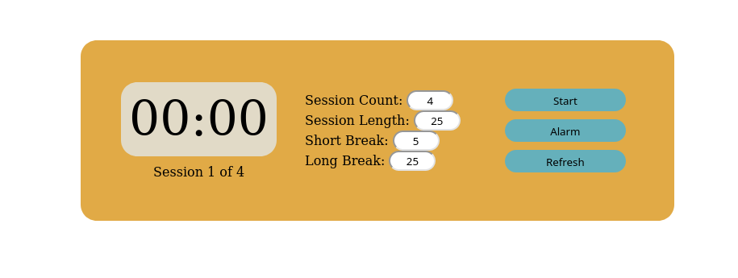

## Pomodoro Timer

View the project live [here](https://brenton-j-andrews.github.io/Pomodoro_Timer/).

---

#### About this project

My most used project by far! A timer that implements the [Pomodoro Time Management Technique](https://en.wikipedia.org/wiki/Pomodoro_Technique).

I was seeking out a project that I would actually use while learning JS basics, and having built a Pomodoro Timer in Python with Tkinter I thought that replicating it in Javascript would be a good idea. This project uses setInterval to keep time, which isn't perfectly precise, but given that this isn't a serious application, a little time error seems acceptable (unless it makes my break a couple milliseconds shorter anyway). 

The timer allows you to adjust the length and count of your study and break periods.

The annoying alarm audio file was sourced from Mixkit.com.

---

#### Frameworks

This project was built using vanilla JavaScript, HTML and CSS.

---

#### Takeaways

This project was my first encounter with callbacks while using JavaScript. I was kind of confused about the setInterval and clearInterval **intervalID** at first, but after reading a tutorial and playing around a bit the confusion was resolved.

---

#### Possible improvements

- Use a more precise library.
- Add the ability to stop the timer cycle.
- Have the timer pause until the alarm is acknowledged by the user.
